# Choisir son pays de destination selon sa profession — tableau de bord Tableau

Tableau de bord interactif classant **216 pays** sur 8 indicateurs de qualité de vie, puis les **re-classant selon la situation professionnelle** du voyageur : salarié, indépendant, étudiant, touriste, sans emploi.

**Résultat clé :** le classement mondial de la qualité de vie est un mauvais guide dès qu'on tient compte de la profession. Le **Rwanda est 216ᵉ sur 216** au classement général — et **1ᵉʳ pour un touriste**. Le **Luxembourg est 1ᵉʳ au général** et seulement **47ᵉ pour un étudiant**. Sur les 10 premiers pays du classement général, **un seul** reste dans le top 10 des quatre profils professionnels.

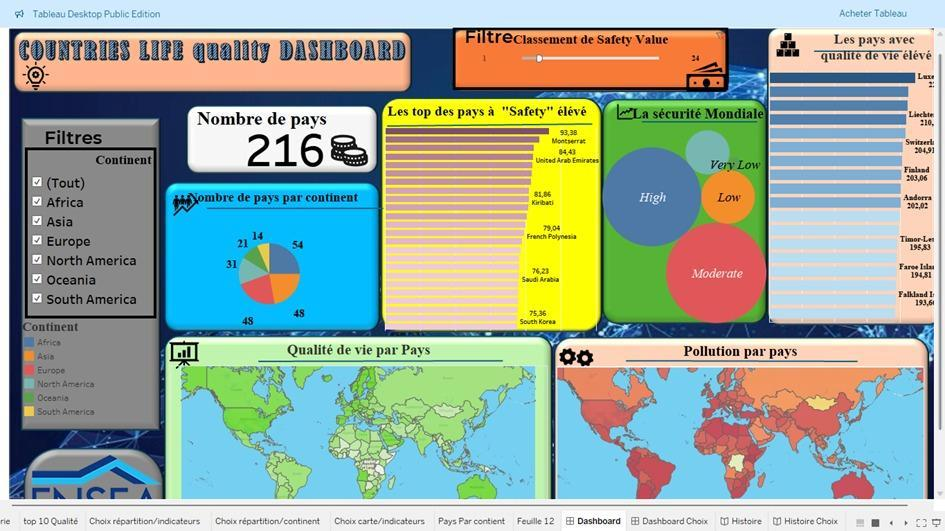

> 🔗 **Tableau de bord interactif :** *(à publier sur Tableau Public — lien à insérer ici)*
> En attendant, le classeur `tableau/quality_of_life_dashboard.twbx` s'ouvre dans Tableau Desktop ou Tableau Public (gratuit).

---

## Contexte

Projet de **Datavisualisation**, ENSEA Abidjan, promotion AS3 option Data Science — **mars 2025**, sous la supervision de Mme LALY MIRABELLE.

L'énoncé demandait de construire un tableau de bord Tableau sur un jeu de données Kaggle. Le groupe a choisi de ne pas s'arrêter à un classement général et de poser la question sous l'angle de l'utilisateur : *quel est le choix optimal de destination d'un individu selon sa situation professionnelle ?* Un étudiant et un homme d'affaires n'arbitrent pas sur les mêmes critères — un classement unique ne peut donc servir les deux.

## Données

Trois sources, toutes publiques :

| Source | Contenu | Volume |
|---|---|---|
| *Quality of Life Index* (Kaggle) | 8 indicateurs chiffrés + leur catégorie, par pays | 236 pays, 19 variables |
| *World Population* (Kaggle) | rattachement pays → continent | 234 pays |
| Base finale produite | indicateurs apurés, normalisés, + 5 scores de profession | **216 pays**, 33 variables |

Les huit indicateurs : pouvoir d'achat, sécurité, système de santé, climat, coût de la vie, rapport prix de l'immobilier / revenu, temps de trajet domicile-travail, pollution.

## Démarche

**Le problème de départ : une base trop trouée pour être visualisée telle quelle.** Les valeurs manquantes sont codées `0.0`, ce qui les rend invisibles aux contrôles habituels. Après recodage en `NaN`, l'ampleur apparaît : **51,7 % des valeurs de climat et de qualité de vie sont absentes**, 19,5 % du pouvoir d'achat, 19,1 % du coût de la vie. Supprimer les pays incomplets aurait vidé la base de plus de la moitié de ses lignes.

| Indicateur | Valeurs manquantes | Part |
|---|---|---|
| Climat | 122 / 236 | 51,7 % |
| Qualité de vie | 122 / 236 | 51,7 % |
| Pouvoir d'achat | 46 / 236 | 19,5 % |
| Coût de la vie | 45 / 236 | 19,1 % |
| Temps de trajet | 34 / 236 | 14,4 % |
| Prix immobilier / revenu | 22 / 236 | 9,3 % |
| Système de santé | 15 / 236 | 6,4 % |
| Pollution | 11 / 236 | 4,7 % |
| Sécurité | 2 / 236 | 0,8 % |

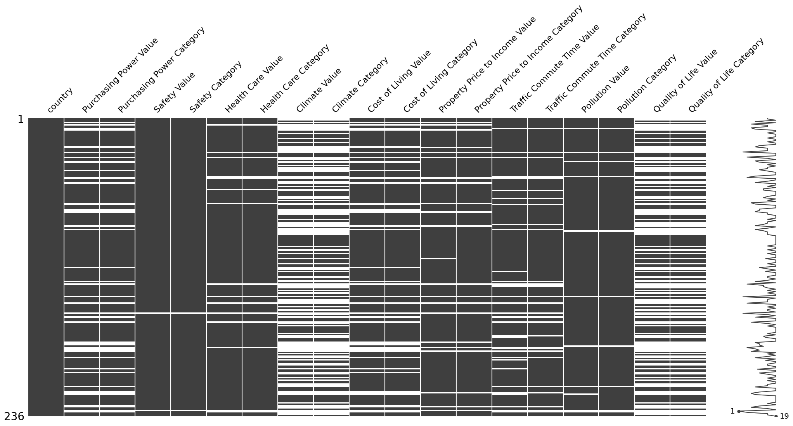

**Imputation par les k plus proches voisins (k = 5).** Le choix se justifie par la structure des données : les pays voisins sur les autres indicateurs ont tendance à se ressembler sur l'indicateur manquant. L'imputation reconstruit donc chaque valeur absente comme la moyenne des 5 pays les plus similaires, plutôt que par une moyenne globale qui aurait écrasé les écarts régionaux. Les **catégories qualitatives** ont ensuite été recalculées à partir des seuils observés sur les valeurs réellement renseignées, puis appliquées à l'ensemble de la base une fois imputée — afin qu'un pays imputé ne reste pas sans catégorie.

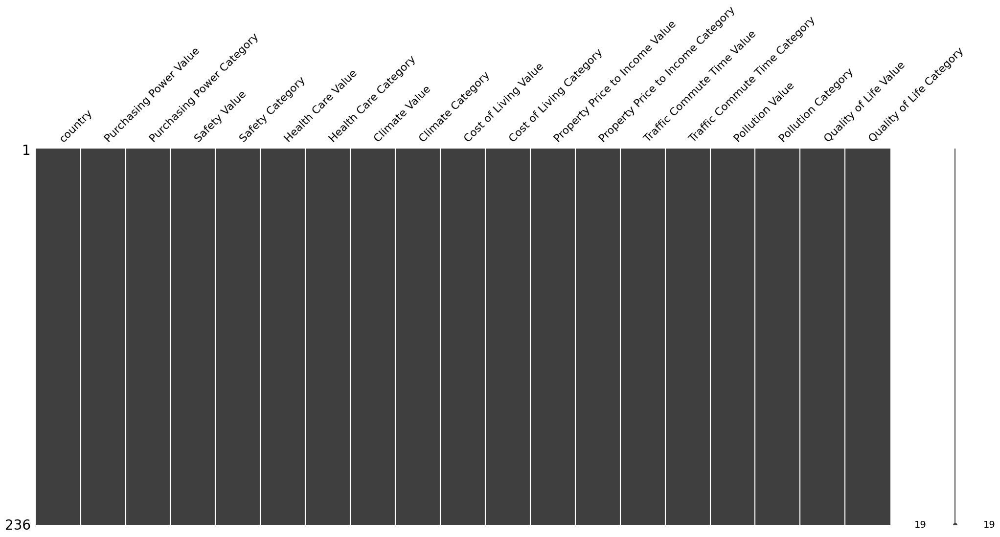

**Construction des scores par profession.** Les 8 indicateurs ont été normalisés sur [0, 1], puis les variables dont la hausse *dissuade* de partir (coût de la vie, prix de l'immobilier, temps de trajet, pollution) ont été multipliées par −1, ramenant l'échelle à [−1, 1]. Pour chaque profil, les 5 indicateurs pertinents sont sommés :

| Profil | Indicateurs retenus |
|---|---|
| **Salarié** | coût de la vie, pouvoir d'achat, temps de trajet, sécurité, santé |
| **Indépendant** | coût de la vie, prix immobilier / revenu, temps de trajet, pollution, climat |
| **Étudiant** | coût de la vie, prix immobilier / revenu, temps de trajet, sécurité, santé |
| **Touriste** | sécurité, pollution, climat, temps de trajet, coût de la vie |
| **Sans emploi** | coût de la vie, prix immobilier / revenu, santé, sécurité, temps de trajet |

## Résultats

**Le classement change de nature selon le profil.** Comparaison entre le rang au classement général « Quality of Life » et le rang selon chaque profil :

| Pays | Général | Étudiant | Salarié | Indépendant | Touriste |
|---|---:|---:|---:|---:|---:|
| Rwanda | 216ᵉ | 172ᵉ | 36ᵉ | 172ᵉ | **1ᵉʳ** |
| Bhoutan | 65ᵉ | 2ᵉ | 8ᵉ | **1ᵉʳ** | 4ᵉ |
| Tuvalu | 18ᵉ | **1ᵉʳ** | **1ᵉʳ** | 57ᵉ | 24ᵉ |
| Luxembourg | **1ᵉʳ** | 47ᵉ | 15ᵉ | 30ᵉ | 32ᵉ |
| Andorre | 10ᵉ | 4ᵉ | 5ᵉ | 7ᵉ | 2ᵉ |

Sur les 10 premiers pays du classement général, seuls **1 à 3 selon le profil** figurent encore dans le top 10 professionnel. Seule **Andorre** tient dans les cinq classements à la fois : c'est le seul compromis universel de la base.

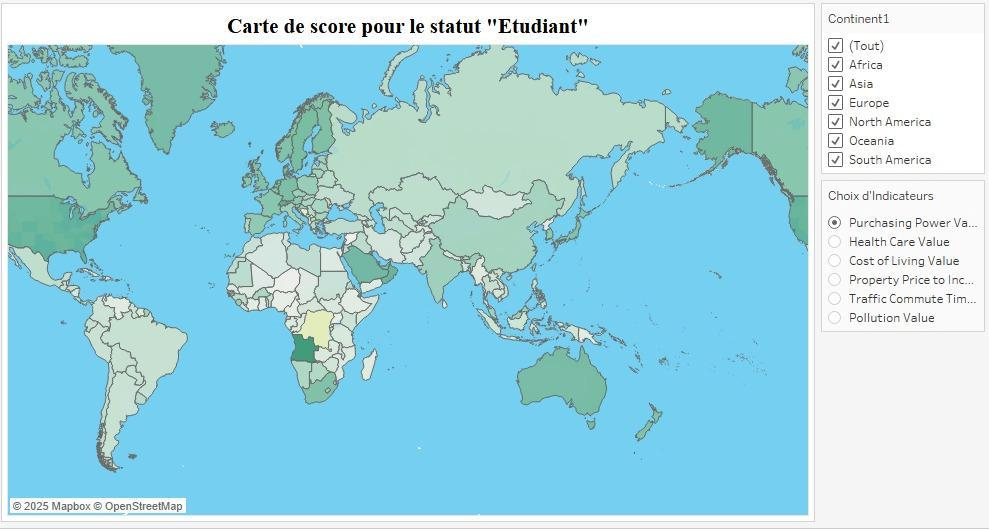

**L'enseignement exploitable.** Un indice composite unique — c'est ce qu'est le « Quality of Life Index » — additionne implicitement des critères dont la personne concernée ne se sert pas. Le désaccord entre les classements n'est pas du bruit : il mesure à quel point l'agrégation d'origine est arbitraire. Un tableau de bord utile doit donc laisser l'utilisateur choisir sa pondération, et non lui livrer un palmarès.

**Le diagnostic transversal, lui, reste stable.** La sécurité mondiale se concentre sur les niveaux « High » et « Moderate », les extrêmes étant marginaux ; et la pollution est un problème géographiquement très inégal, l'Afrique et l'Asie concentrant l'essentiel du volume.

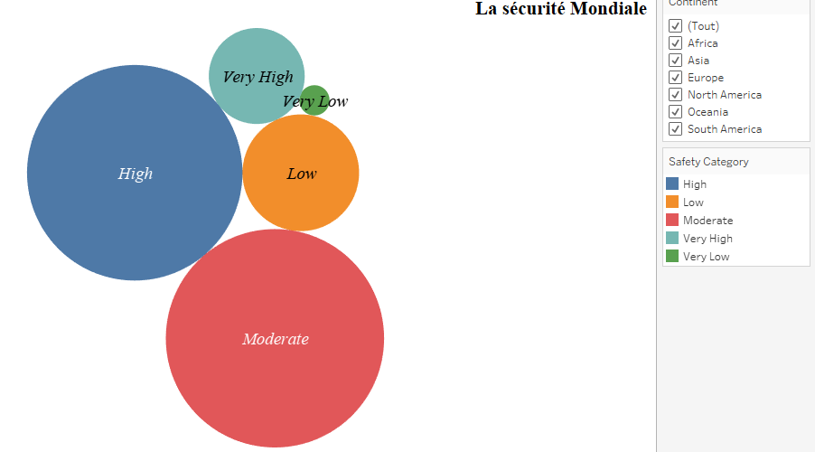
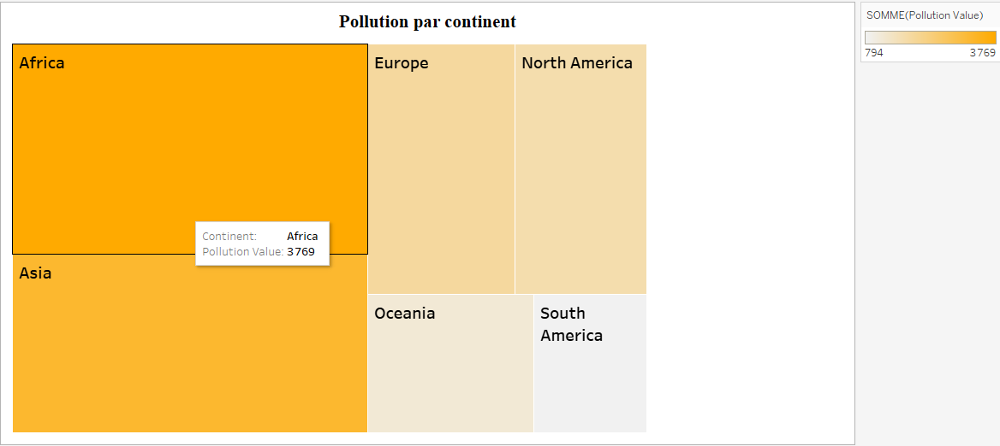

<details>
<summary><b>Autres feuilles et tableaux de bord du classeur</b> (cliquer pour déplier)</summary>

Carte de la qualité de vie par pays :
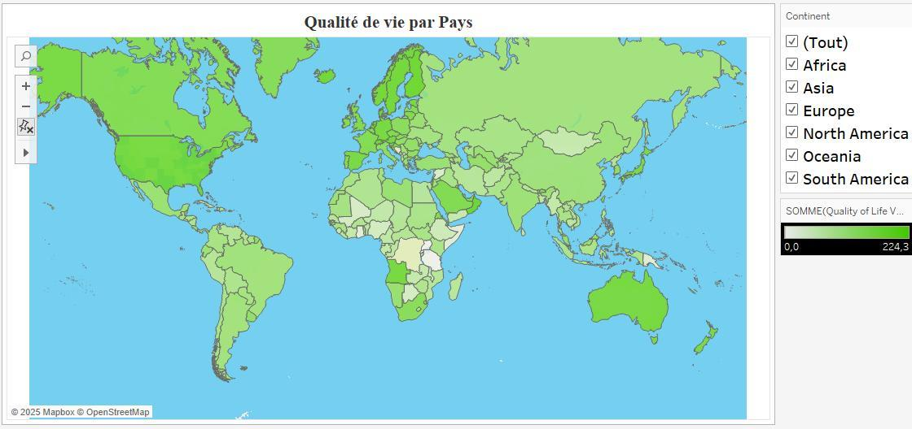

Second tableau de bord, avec sélecteur d'indicateur : l'utilisateur choisit la variable affichée parmi les huit, et la carte, la répartition par continent et le classement par pays se recalculent ensemble.
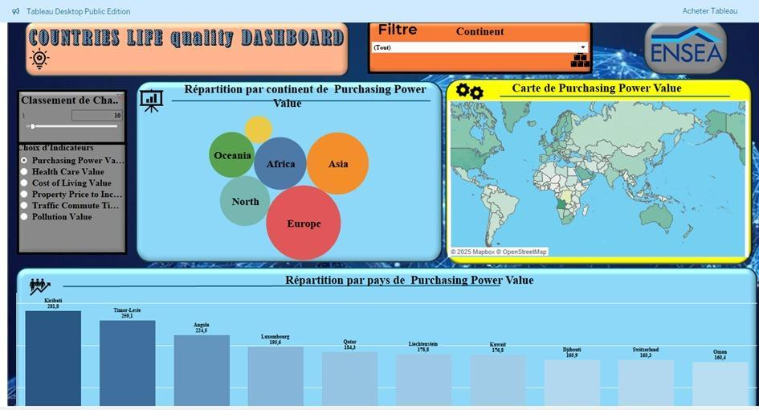

Classement des pays sur l'indicateur sélectionné, et carte de la pollution :
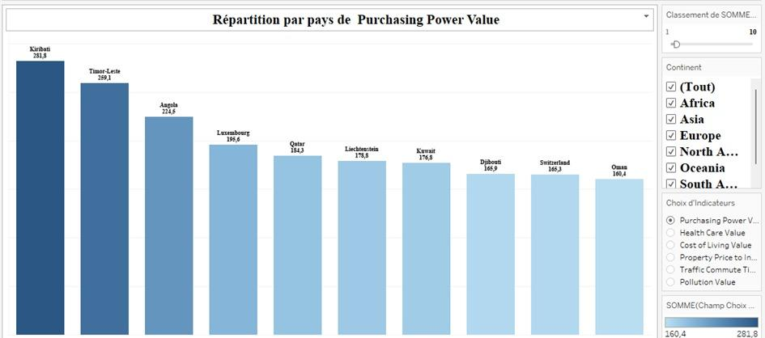
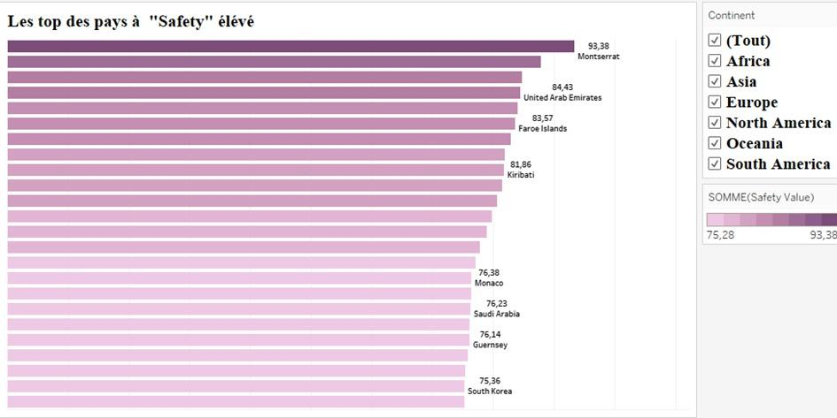
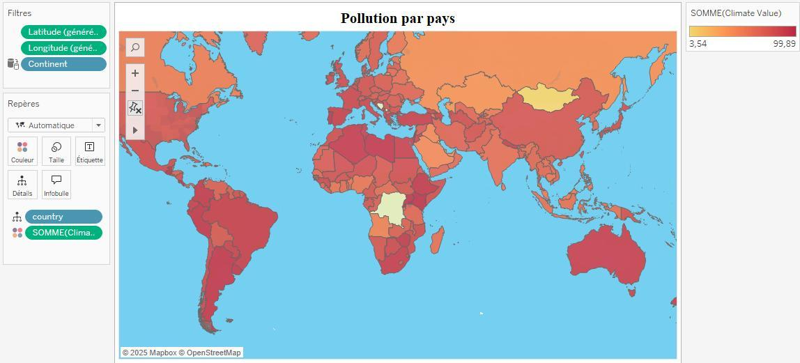

Contrôle des valeurs manquantes après fusion des deux sources :
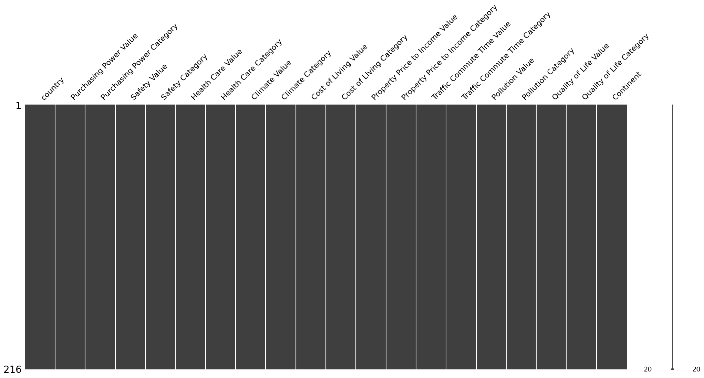

</details>

## Limites et pistes d'amélioration

Quatre réserves, assumées.

**Les profils « étudiant » et « sans emploi » retiennent les cinq mêmes indicateurs.** Leurs scores sont donc *strictement identiques* sur les 216 pays — vérifié : zéro écart. Les cinq profils annoncés ne produisent en réalité que **quatre classements distincts**. Différencier les deux profils supposerait d'écarter au moins un critère de l'un des deux, ou de les pondérer différemment.

**La fusion avec la base des continents a fait perdre 20 pays et territoires** (236 → 216), non par absence de données mais par différence d'orthographe entre les deux sources : `Antigua And Barbuda` contre `Antigua and Barbuda`, `Hong Kong (China)` contre `Hong Kong`, `Democratic Republic of the Congo` contre `DR Congo`. Une normalisation des noms de pays — ou mieux, une jointure sur code ISO à trois lettres, déjà présent dans la base de population — récupérerait ces 20 lignes.

**Les scores sont des sommes non pondérées**, ce qui suppose que les cinq critères d'un profil pèsent exactement autant. C'est ce qui explique les positions contre-intuitives : l'inversion du coût de la vie récompense mécaniquement les pays les moins chers, sans contrepartie de revenu ou d'opportunité. Une pondération explicite, ou un curseur de pondération dans le tableau de bord, rendrait le classement défendable.

**Certains pays reposent presque entièrement sur des valeurs imputées.** Montserrat, dont **8 des 9 indicateurs** ont été estimés, se classe 6ᵉ pour le profil étudiant. La corrélation entre le nombre de valeurs imputées et le score reste faible à l'échelle de la base (−0,11), donc l'imputation ne biaise pas le classement d'ensemble — mais un indicateur de fiabilité par pays devrait accompagner l'affichage.

## Reproduire l'analyse

```bash
git clone https://github.com/<TON-PSEUDO>/quality-of-life-dataviz.git
cd quality-of-life-dataviz
pip install -r requirements.txt
jupyter notebook traitement_donnees.ipynb
```

Le notebook part de `data/quality_of_life_brut.csv` et reconstruit la base apurée et normalisée. Le classeur Tableau s'ouvre ensuite directement : `tableau/quality_of_life_dashboard.twbx` embarque ses propres données et ne nécessite aucune reconnexion.

## Contenu du dépôt

```
traitement_donnees.ipynb                          Apurement, imputation KNN, normalisation
data/quality_of_life_brut.csv                     Base source (236 pays, 19 variables)
data/quality_of_life_final_scores_profession.csv  Base finale (216 pays, + 5 scores)
data/world_population.csv                         Base de rattachement aux continents
data/world_continent_country.csv                  Table pays → continent extraite
tableau/quality_of_life_dashboard.twbx            Classeur Tableau complet (feuilles,
                                                  tableaux de bord, storytelling)
images/                                           Captures des visualisations
reports/rapport_projet.pdf                        Rapport détaillé du projet
```

## Outils

Tableau Desktop / Tableau Public (tableaux de bord, cartes, storytelling, filtres et paramètres) · Python (pandas, NumPy) · scikit-learn (`KNNImputer`, `MinMaxScaler`) · missingno

---

## Équipe et contribution

Projet de groupe réalisé à l'ENSEA Abidjan, en quatre séances de travail collectives.

**KONE Abdoulaye** — apurement et imputation de la base de données, recodage des variables catégorielles, fusion des sources
ADDOH N'chot Serge — mise en forme et harmonisation graphique des tableaux de bord
KOUASSI Yao Kra Emmanuel — construction des variables de classification par profession

> Projet académique réalisé à des fins pédagogiques. L'énoncé original du devoir, propriété de l'ENSEA, n'est pas reproduit dans ce dépôt. Les données proviennent de jeux publics disponibles sur Kaggle.

**Abdoulaye KONE** — Statisticien, diplômé de l'ENSEA
[LinkedIn](https://linkedin.com/in/abdoulaye-kone)
