# Choisir son pays de destination selon sa profession — tableau de bord Tableau

Tableau de bord interactif classant **230 pays** sur 8 indicateurs de qualité de vie, puis les **re-classant selon la situation professionnelle** du voyageur : salarié, indépendant, étudiant, touriste, sans emploi.

**Résultat clé :** le classement mondial de la qualité de vie est un mauvais guide dès qu'on tient compte de la profession. Le **Rwanda est 228ᵉ sur 230** au classement général — et **1ᵉʳ pour un touriste**. Le **Luxembourg est 1ᵉʳ au général** et **52ᵉ pour un étudiant**. Les dix premiers du classement général ont peu de pays en commun avec les classements par profil.

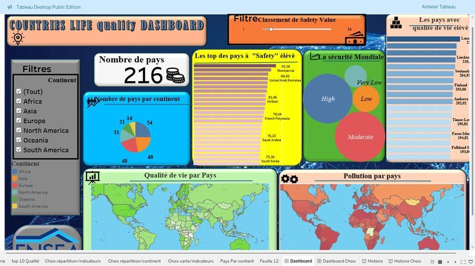

Les principales vues sont consultables dans les captures ci-dessous. Pour explorer le classeur, télécharge `tableau/quality_of_life_dashboard.twbx` depuis GitHub et ouvre-le avec Tableau Desktop ou Tableau Public. Le classeur contient un extrait de données, mais l'actualisation peut demander de reconnecter les fichiers source, car certaines connexions conservent des chemins locaux de sa création. Aucune publication sur Tableau Public n'est prévue.

### Guide de lecture

1. Commence par le tableau de bord général pour situer les pays sur l'indice global.
2. Dans le tableau de bord des indicateurs, choisis un indicateur et compare sa carte, sa distribution par continent et son classement par pays.
3. Dans la vue par profession, sélectionne un profil et compare son classement aux autres critères de la base. Le score sert à comparer les pays selon les hypothèses du projet, pas à fournir une recommandation personnalisée de déménagement.

---

## Contexte

Projet de **Datavisualisation**, ENSEA Abidjan, promotion AS3 option Data Science — **mars 2025**, sous la supervision de Mme LALY MIRABELLE.

L'énoncé demandait de construire un tableau de bord Tableau sur un jeu de données Kaggle. Le groupe a choisi de ne pas s'arrêter à un classement général et de poser la question sous l'angle de l'utilisateur : *quel est le choix optimal de destination d'un individu selon sa situation professionnelle ?* Un étudiant et un homme d'affaires n'arbitrent pas sur les mêmes critères — un classement unique ne peut donc servir les deux.

## Données

Deux sources de données et une base dérivée :

| Source | Contenu | Volume / licence |
|---|---|---|
| [Quality of Life for Each Country](https://www.kaggle.com/datasets/ahmedmohamed2003/quality-of-life-for-each-country) | 9 indicateurs chiffrés et leurs catégories, issus de Numbeo | 236 pays, 19 variables. La page indique la licence d'utilisation des données Numbeo ; consulter ses [conditions](https://www.numbeo.com/premium/commercial-license). |
| [World Population Dataset](https://www.kaggle.com/datasets/iamsouravbanerjee/world-population-dataset) | rattachement pays → continent | 234 pays. Kaggle affiche une licence « Other » ; vérifier les conditions auprès de la source avant redistribution. |
| Base finale produite | indicateurs apurés, normalisés, nombre d'imputations + 5 scores de profession | **230 pays**, 34 variables |

Les huit indicateurs : pouvoir d'achat, sécurité, système de santé, climat, coût de la vie, rapport prix de l'immobilier / revenu, temps de trajet domicile-travail, pollution.

## Démarche

**Le problème de départ : une base trop trouée pour être visualisée telle quelle.** Les valeurs manquantes sont codées `0.0`, ce qui les rend invisibles aux contrôles habituels. Après recodage en `NaN`, l'ampleur apparaît : **51,7 % des valeurs de climat et de qualité de vie sont absentes**, 19,5 % du pouvoir d'achat, 19,1 % du coût de la vie. Supprimer les pays incomplets aurait vidé la base de plus de la moitié de ses lignes.

| Indicateur | Valeurs manquantes | Part |
|---|---|---|
| Climat | 122 / 236 | 51,7 % |
| Qualité de vie | 122 / 236 | 51,7 % |
| Pouvoir d'achat | 46 / 236 | 19,5 % |
| Coût de la vie | 45 / 236 | 19,1 % |
| Temps de trajet | 34 / 236 | 14,4 % |
| Prix immobilier / revenu | 22 / 236 | 9,3 % |
| Système de santé | 15 / 236 | 6,4 % |
| Pollution | 11 / 236 | 4,7 % |
| Sécurité | 2 / 236 | 0,8 % |

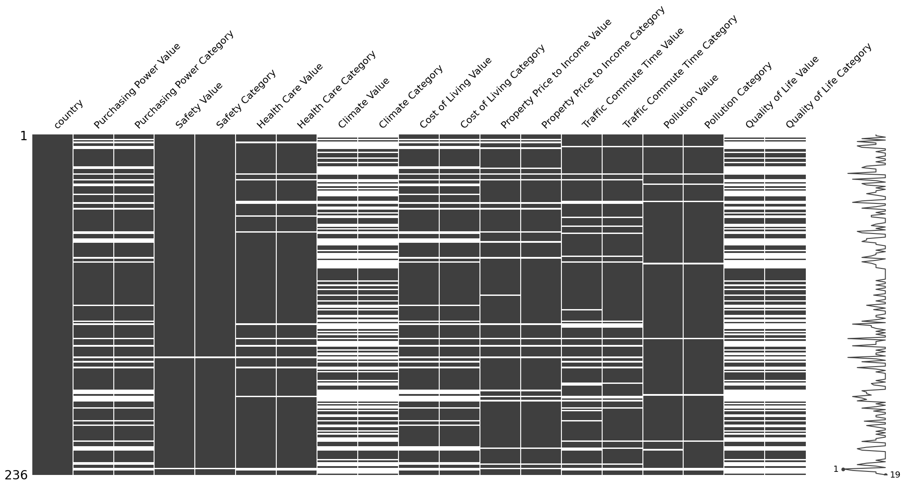

**Imputation par les k plus proches voisins (k = 5).** Les neuf indicateurs sont d'abord ramenés sur une échelle commune pour calculer les distances entre pays, puis les valeurs imputées sont reconverties dans leurs unités d'origine. Cela évite qu'un indicateur à grande amplitude domine mécaniquement la recherche des voisins. Les **catégories qualitatives** manquantes sont complétées à partir des seuils observés pour chaque indicateur. La base finale conserve aussi le nombre d'indicateurs imputés pour chaque pays, afin de rendre cette information visible.

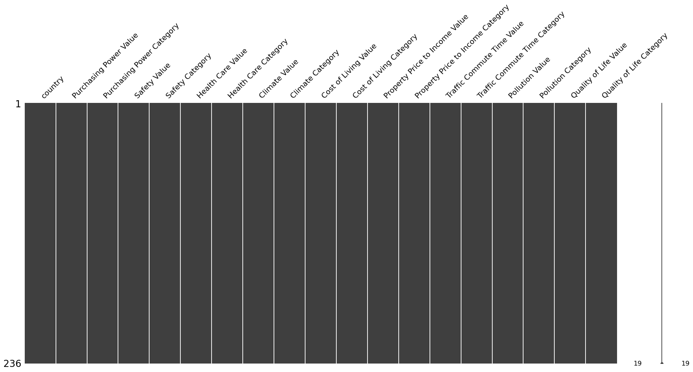

**Construction des scores par profession.** Les huit indicateurs utilisés sont normalisés sur [-1, 1]. Le signe du coût de la vie, du prix immobilier / revenu, du temps de trajet et de la pollution est inversé pour que les valeurs élevées contribuent positivement au score. Les cinq critères de chaque profil sont ensuite additionnés sans pondération :

| Profil | Indicateurs retenus |
|---|---|
| **Salarié** | coût de la vie, pouvoir d'achat, temps de trajet, sécurité, santé |
| **Indépendant** | coût de la vie, prix immobilier / revenu, temps de trajet, pollution, climat |
| **Étudiant** | coût de la vie, prix immobilier / revenu, temps de trajet, sécurité, santé |
| **Touriste** | sécurité, pollution, climat, temps de trajet, coût de la vie |
| **Sans emploi** | coût de la vie, prix immobilier / revenu, santé, sécurité, temps de trajet |

## Résultats

**Le classement change de nature selon le profil.** Comparaison entre le rang au classement général « Quality of Life » et le rang selon chaque profil :

| Pays | Général | Étudiant | Salarié | Indépendant | Touriste |
|---|---:|---:|---:|---:|---:|
| Rwanda | 228ᵉ | 188ᵉ | 38ᵉ | 181ᵉ | **1ᵉʳ** |
| Bhoutan | 50ᵉ | 2ᵉ | 9ᵉ | **1ᵉʳ** | 4ᵉ |
| Tuvalu | 32ᵉ | **1ᵉʳ** | **1ᵉʳ** | 52ᵉ | 21ᵉ |
| Luxembourg | **1ᵉʳ** | 52ᵉ | 15ᵉ | 37ᵉ | 37ᵉ |
| Andorre | 18ᵉ | 4ᵉ | 6ᵉ | 11ᵉ | 3ᵉ |

Parmi les dix premiers du classement général, **0 à 3 pays** figurent aussi dans le top 10 d'un profil donné. Aucun pays ne figure simultanément dans le top 10 général et dans les cinq classements professionnels. **Andorre** reste bien placée pour quatre profils, mais arrive 11ᵉ pour les indépendants.

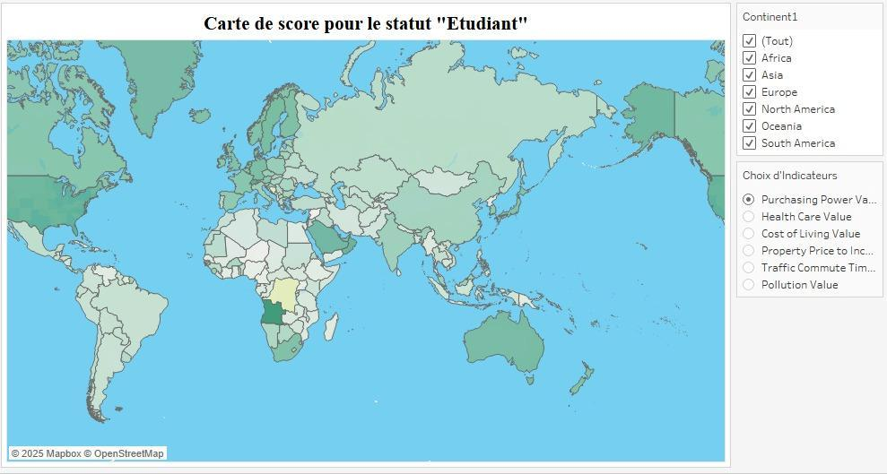

**L'enseignement exploitable.** Un indice composite unique — c'est ce qu'est le « Quality of Life Index » — additionne implicitement des critères dont la personne concernée ne se sert pas. Le désaccord entre les classements n'est pas du bruit : il mesure à quel point l'agrégation d'origine est arbitraire. Un tableau de bord utile doit donc laisser l'utilisateur choisir sa pondération, et non lui livrer un palmarès.

**Le diagnostic transversal, lui, reste stable.** La sécurité mondiale se concentre sur les niveaux « High » et « Moderate », les extrêmes étant marginaux ; et la pollution est un problème géographiquement très inégal, l'Afrique et l'Asie concentrant l'essentiel du volume.

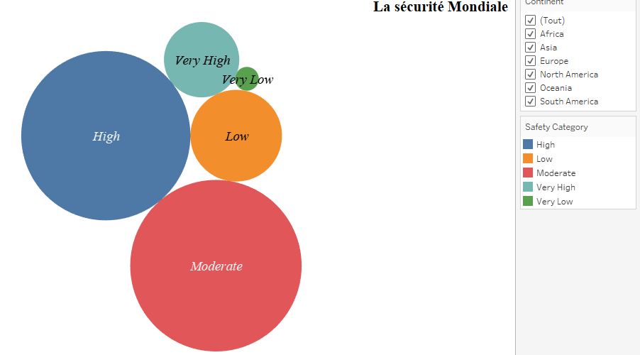
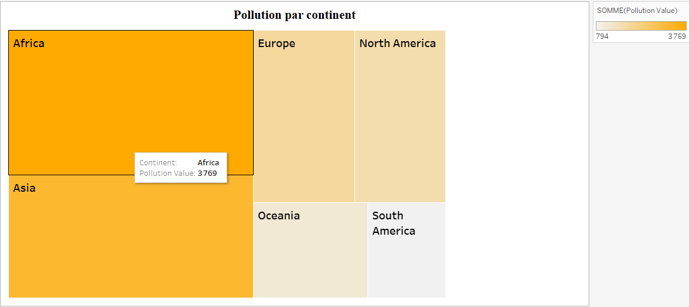

<details>
<summary><b>Autres feuilles et tableaux de bord du classeur</b> (cliquer pour déplier)</summary>

Carte de la qualité de vie par pays :
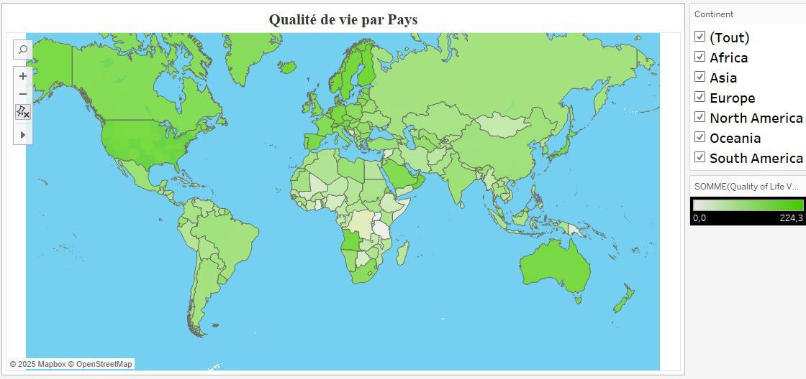

Second tableau de bord, avec sélecteur d'indicateur : l'utilisateur choisit la variable affichée parmi les huit, et la carte, la répartition par continent et le classement par pays se recalculent ensemble.
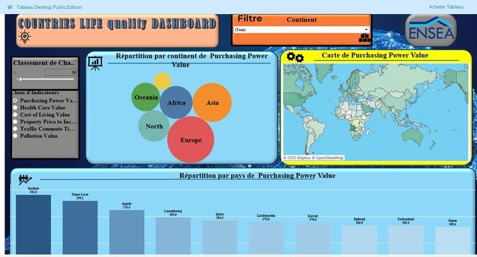

Classement des pays sur l'indicateur sélectionné, et carte de la pollution :
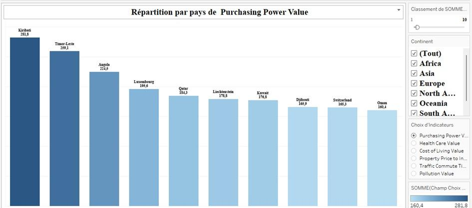
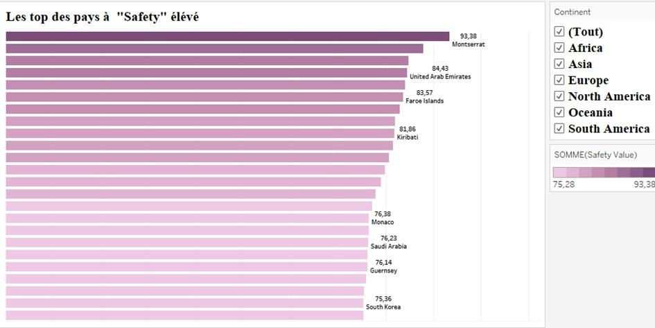
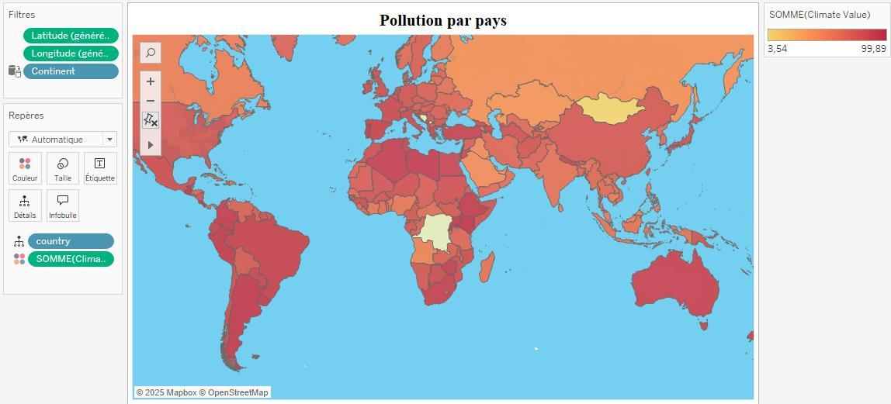

Contrôle des valeurs manquantes après fusion des deux sources :
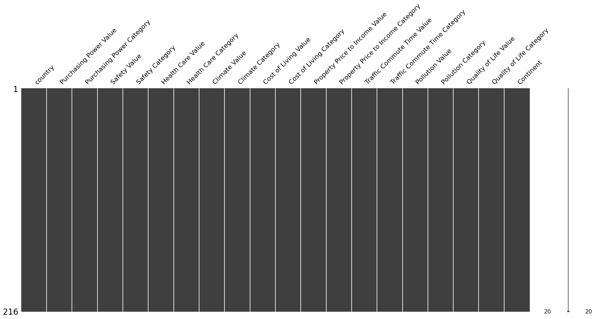

</details>

## Limites et pistes d'amélioration

Cinq réserves, assumées.

**Les profils « étudiant » et « sans emploi » retiennent les cinq mêmes indicateurs.** Leurs scores sont donc *strictement identiques* sur les 230 pays — vérifié : zéro écart. Les cinq profils annoncés ne produisent en réalité que **quatre classements distincts**. Différencier les deux profils supposerait d'écarter au moins un critère de l'un des deux, ou de les pondérer différemment.

**La fusion avec la base des continents exclut encore 6 pays et territoires** (236 → 230), car ils n'ont pas d'équivalent dans cette source. La normalisation des noms et trois alias explicites ont récupéré les 14 autres correspondances, malgré les différences de casse, de ponctuation ou d'appellation. Une jointure par code ISO à trois lettres serait préférable si les deux sources fournissaient ce code.

**Les scores sont des sommes non pondérées**, ce qui suppose que les cinq critères d'un profil pèsent exactement autant. C'est ce qui explique les positions contre-intuitives : l'inversion du coût de la vie récompense mécaniquement les pays les moins chers, sans contrepartie de revenu ou d'opportunité. Une pondération explicite, ou un curseur de pondération dans le tableau de bord, rendrait le classement défendable.

**Certains pays reposent presque entièrement sur des valeurs imputées.** Montserrat, dont **8 des 9 indicateurs** ont été estimés, se classe 7ᵉ pour le profil étudiant. Le nombre imputé est maintenant fourni dans la base finale ; il signale une dépendance aux estimations, mais ne constitue pas à lui seul une mesure statistique de fiabilité.

**Les visuels Tableau sont un instantané antérieur au recalcul.** Le classeur et les captures du dépôt n'ont pas été actualisés avec les nouvelles imputations et les nouveaux scores. Les classements actuels sont ceux du CSV final généré par le notebook ; il faudra actualiser l'extrait Tableau dans l'application pour faire concorder les deux.

Le [rapport PDF](reports/rapport_projet.pdf) documente le rendu académique original. Il n'a pas été recalculé avec cette version du notebook ; ses chiffres et sa description de méthode peuvent donc différer des exports actuels.

## Reproduire l'analyse

```bash
git clone https://github.com/abdoul4Kone/quality-of-life-dataviz.git
cd quality-of-life-dataviz
pip install -r requirements.txt
jupyter notebook traitement_donnees.ipynb
```

Le notebook part de `data/quality_of_life_brut.csv` et reconstruit les bases nettoyée, normalisée et finale. Le CSV final utilise le séparateur standard virgule et le point décimal ; il s'ouvre directement avec `pandas.read_csv()`.

Le classeur `tableau/quality_of_life_dashboard.twbx` est fourni pour consultation locale, sans lien Tableau Public. Son extrait intégré correspond à une version antérieure des données ; reconnecte-le au CSV final avant d'actualiser les vues.

## Contenu du dépôt

```
traitement_donnees.ipynb                          Apurement, imputation KNN, normalisation
data/quality_of_life_brut.csv                     Base source (236 pays, 19 variables)
data/quality_of_life_cleaned.csv                  Base apurée et fusionnée (230 pays)
data/quality_of_life_cleaned_data_normalized.csv   Indicateurs normalisés (230 pays)
data/quality_of_life_final_scores_profession.csv  Base finale (230 pays, 34 variables)
data/world_population.csv                         Base de rattachement aux continents
data/world_continent_country.csv                  Table pays → continent (sans index parasite)
tableau/quality_of_life_dashboard.twbx            Classeur Tableau complet (feuilles,
                                                  tableaux de bord, storytelling)
images/                                           Captures des visualisations
reports/rapport_projet.pdf                        Rapport détaillé du projet
```

## Outils

Tableau Desktop / Tableau Public (tableaux de bord, cartes, storytelling, filtres et paramètres) · Python (pandas, NumPy) · scikit-learn (`KNNImputer`, `MinMaxScaler`) · missingno

---

## Équipe et contribution

Projet de groupe réalisé à l'ENSEA Abidjan, en quatre séances de travail collectives.

**KONE Abdoulaye** — apurement et imputation de la base de données, recodage des variables catégorielles, fusion des sources
ADDOH N'chot Serge — mise en forme et harmonisation graphique des tableaux de bord
KOUASSI Yao Kra Emmanuel — construction des variables de classification par profession

> Projet académique réalisé à des fins pédagogiques. L'énoncé original du devoir, propriété de l'ENSEA, n'est pas reproduit dans ce dépôt. Les données proviennent de jeux publics disponibles sur Kaggle.

**Abdoulaye KONE** — Analyste Statisticien, diplômé de l'Ecole Nationale Supérieure de Statistique et Economie Appliquée (ENSEA d'Abidjan)
[LinkedIn](https://linkedin.com/in/abdoulaye-kone)
